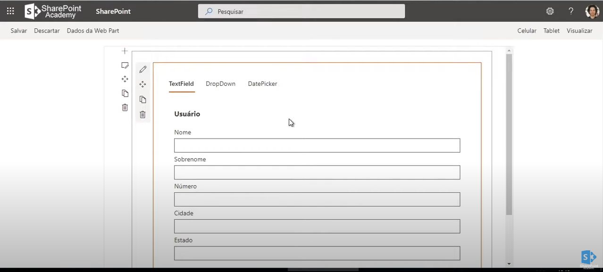

# FluentUI Pivot,TextField and DropDown

## Summary

In this project we will learn how to create a webpart and use the components Pivot, TextField and DropDown.

## Compatibility

-Incompatible-red.svg "SharePoint Server 2016 Feature Pack 2 requires SPFx 1.1")

## Applies to

- [SharePoint Framework](https://aka.ms/spfx)
- [Microsoft 365 tenant](https://docs.microsoft.com/en-us/sharepoint/dev/spfx/set-up-your-developer-tenant)

> Get your own free development tenant by subscribing to [Microsoft 365 developer program](http://aka.ms/o365devprogram)
## Prerequisites

None

## Solution

Solution|Author(s)
--------|---------
react-fluentui-pivot | [Saulo Oliveira](https://br.linkedin.com/in/saulosoaresoliveira), m365 Consultant.

## Version history

Version|Date|Comments
-------|----|--------
1.0.0|November 01, 2021|Initial release

## Minimal Path to Awesome

- Clone this repository
- Ensure that you are at the solution folder
- in the command-line run:
  - **npm install**
  - **gulp serve**

## Features

### Add the part

Once the solution is installed in the app catalog and the app has been added to the site, you should see it available to a page the webpart fluentuiHome.

