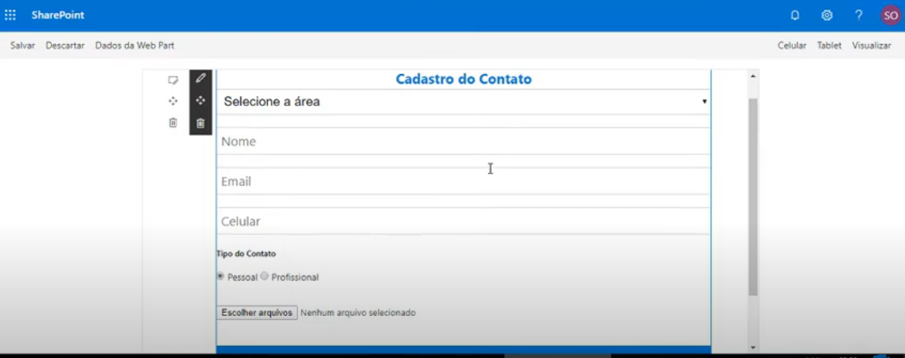
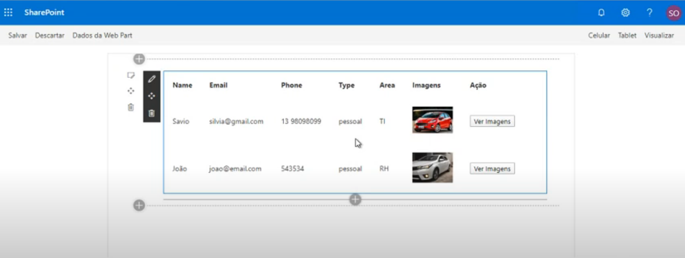

# PNP Create and List Contact

## Summary

In this project we have two webparts, one for registering contacts and another for listing. In the register we have file upload and dropdown. In the list we have a grid listing the contacts with the main photo and a button to open a modal and view the other photos.





## Compatibility


-Incompatible-red.svg "SharePoint Server 2016 Feature Pack 2 requires SPFx 1.1")


## Applies to

- [SharePoint Framework](https://aka.ms/spfx)
- [Microsoft 365 tenant](https://docs.microsoft.com/en-us/sharepoint/dev/spfx/set-up-your-developer-tenant)

> Get your own free development tenant by subscribing to [Microsoft 365 developer program](http://aka.ms/o365devprogram)
## Prerequisites

None

## Solution

Solution|Author(s)
--------|---------
react-pnp-contact | [Saulo Oliveira](https://br.linkedin.com/in/saulosoaresoliveira), m365 Consultant.

## Version history

Version|Date|Comments
-------|----|--------
1.0.0|November 01, 2021|Initial release

## Minimal Path to Awesome

- Clone this repository
- Ensure that you are at the solution folder
- in the command-line run:
  - **npm install**
  - **gulp serve**

### Lists and Picture Library

```
Create a List - Product
Fields      Type       
name        text
stock       number
price       currency

Create a List - Areas
Fields      Type       
Title       text

Create a List - Usuarios
Fields          Type       
name            text
email           text
phone           text
type            text
area            lookup (list Areas)
defaultImage    text

Create a Picture Library - Imagens

```

## Features

### Add the part

Once the solution is installed in the app catalog and the app has been added to the site, you should see it available to a page the webpart cadastraProduto, cadastraUsuario and listContatos.


